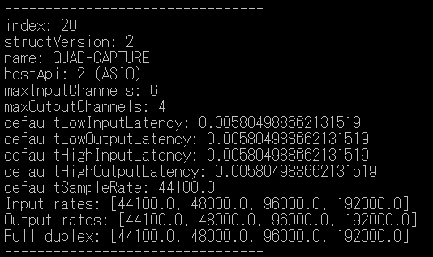

#  PyAudio Record, filter, and Play   
    
This is an experiment of PyAudio full duplex, record, filter, mix, and play simultaneously via ASIO.  
   
[github repository](https://github.com/shun60s/PyAudio-full-duplex/)  
  

## description  

Roland's old QUAD-CAPTURE has 4in/4out and can record and play simultaneously via ASIO.  
Digtal audio music source is connected to COAXIAL IN (3-4) via SPDIF, FS=48KHz,  
Analog signal like MIC is connected to  analog INPUT(1-2).  
Via python scipy filter LPF/HPF, the music source mid sound is removed, and low and high sound remains.  
And then, mix analog input(1-2) with the sound, and output from OUTPUT 1L/2R(1-2).   
Turn MIX on QUAD-CAPTURE panel into PLAYBACK only.  

music(Digital)---> COAXIAL IN(3-4) ---> Filter --|   
.                                                |   
MIC(Analog)   ---> INPUT 1L/2R(1-2) ----------> Mix --->  OUTPUT 1L/2R(1-2)  

### rec_play1.py  
This is the program of the signal flow above.  

###  system_info.py  
This useful program will show index, HostAPIs, Devices, and their support rates.  
For example,  

  

## License  

MIT  

Regarding to system_info.py, please refer copyright and license notice in the content.  

